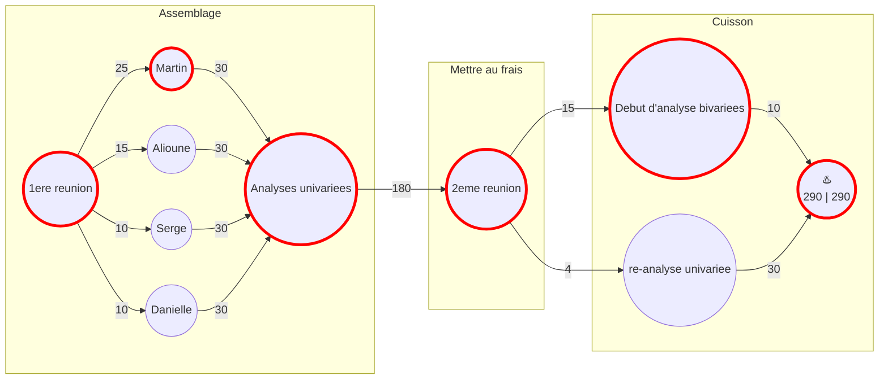

```mermaid
graph LR
    X(("1ere reunion"))
    style X stroke:red,stroke-width:4px
    A(("`Martin`"))
    style A stroke:red,stroke-width:4px
    B(("`Analyses univariees`"))
    style B stroke:red,stroke-width:4px
    C(("`Alioune`"))
    D(("`Serge`"))
    I(("`Danielle`"))

    E(("`2eme reunion`"))
    style E stroke:red,stroke-width:4px
    F(("`Debut d'analyse bivariees`"))
    style F stroke:red,stroke-width:4px
    G(("`re-analyse univariee`"))
    H(("`♨️ 
    290 | 290`"))
    style H stroke:red,stroke-width:4px
    subgraph Assemblage
    X -- 25 --> A
    X -- 15 --> C
    X -- 10 --> D
    X --10 --> I
    A -- 30 --> B
    C -- 30 --> B
    D -- 30 --> B
    I -- 30 --> B
    end
    subgraph Mettre au frais
    B -- 180 --> E
    end
    subgraph Cuisson
    E -- 15 --> F

    E -- 4 --> G
    F -- 10 --> H
    G -- 30 --> H
    
    end
```
[https://meteo.data.gouv.fr/datasets/65e040c50a5c6872ebebc711](https://www.data.gouv.fr/fr/datasets/r/d6a8fdb8-8c81-4e76-aaa4-f433d16b5550)
