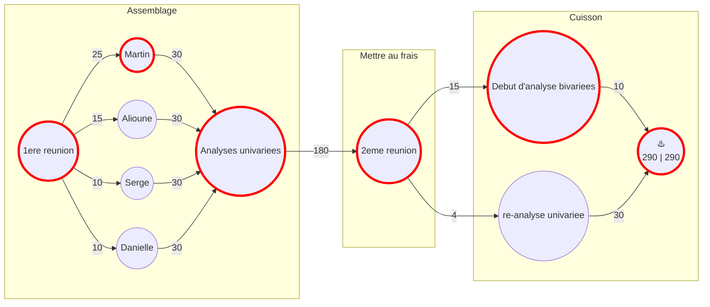

on doit s'interresser a une ou deux variables( **pluies**, temp, vent) en fonction de l'altitude et la longitude et latitude et prendre just une periode de l'annee par exemple l'hivers
pour la variable RR(pluies), on enleve les données manquantes
fextRemes (package R)
ismev (celui du livre, on ne va pas utiliser)
imputation de données ( pour les donnees manquantes)
voir les donnee manquantes, si c les premieres annees on pourra enlever les annees 50s

definir les stations qu'on garde, par ex garder 50 stations et faire des boxplots et faire des cartes (heatmap modeliser par rapport a la position , modeliser avec l'approche des valeurs extremes)

TO DO:
bien choisir quelles stations on prend et quelle variable on prend (+ stat descriptives)
modeliser le max de la variable pour chaque année par station de meteo
ajuster la loi des valeurs extremes aux donnés 
carte de france+ poser les stations sur la carte de france
si l'approche classique, on prend le max de chaque années, pour 50 années, puis on pourra extrapoler 
probleme: grande perte de données

